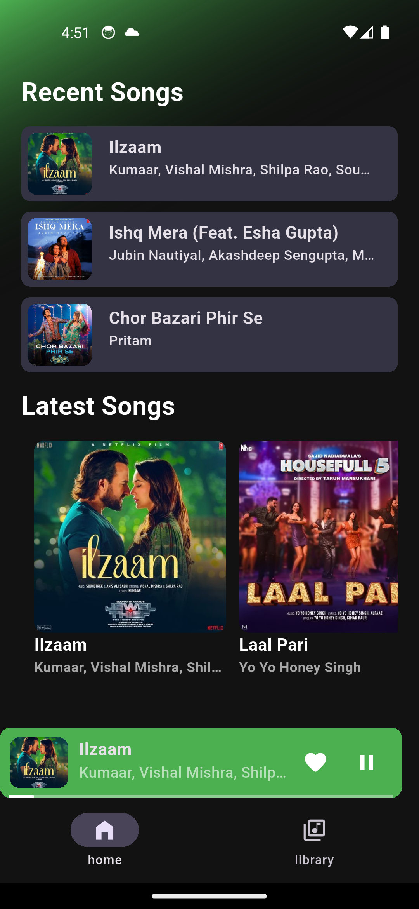
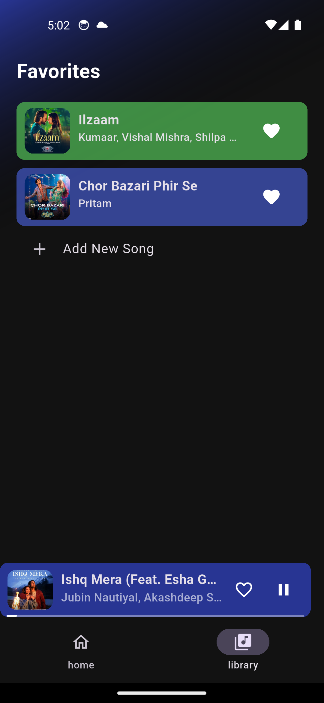
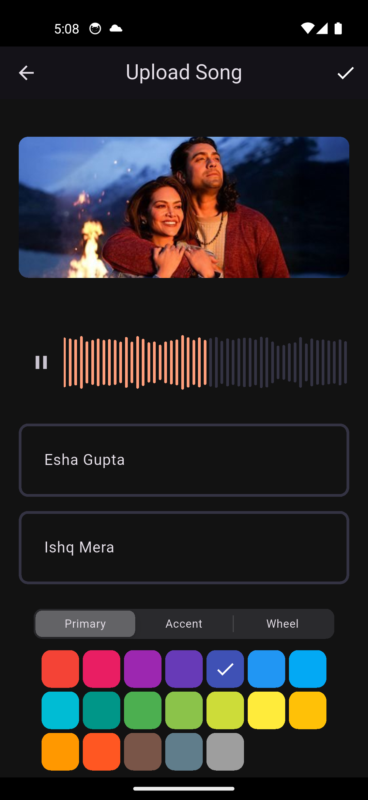
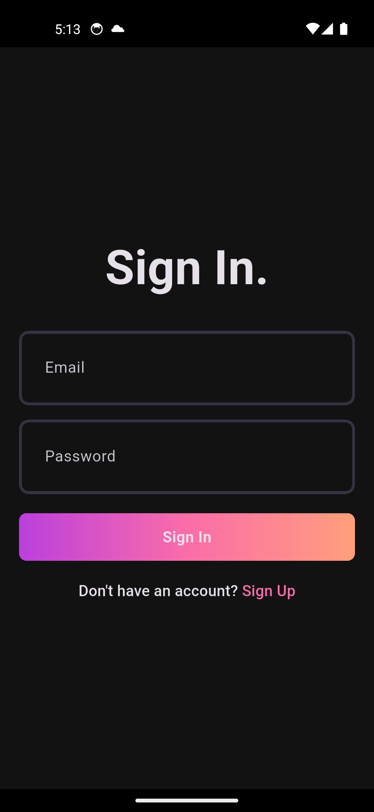
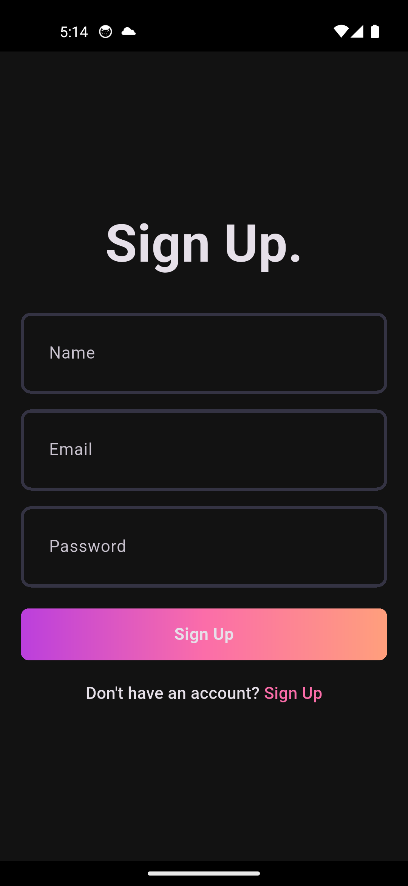

# Spotify Clone

A Flutter-based Spotify clone.

## ✨ Features

- User Authentication
- Song Management (upload, favorite, recent)
- Music Player
- Local Caching (Hive)

## 🚀 Technologies Used

- Flutter
- Riverpod
- Hive
- Just Audio
- HTTP

## ⚙️ Setup and Installation

1.  **Clone the repository:** `git clone https://github.com/YOUR_USERNAME/spotify_clone.git`
2.  **Navigate to project:** `cd spotify_clone/c_lient`
3.  **Get dependencies:** `flutter pub get`
4.  **Run code generator:** `flutter pub run build_runner build --delete-conflicting-outputs`
5.  **Configure Android Signing (for release builds):** Update `android/key.properties` with your keystore path.

## ▶️ Running the Application

```bash
flutter run
```

## 🤝 Contributing

Contributions are welcome! If you have any suggestions, bug reports, or want to contribute to the project, please feel free to open an issue or a pull request.

## 📄 License

This project is licensed under the MIT License - see the [LICENSE](LICENSE) file for details.

## 🙏 Credits

- Inspired by Spotify.
- Built with Flutter and Riverpod.
- Special thanks to the developers of all the amazing Flutter packages used in this project.

## 📸 Screenshots

<table>
  <tr>
    <td align="center">
      
      <br />
      <em>Home Page</em>
    </td>
    <td align="center">
      
      <br />
      <em>Music Player</em>
    </td>
    <td align="center">
      
      <br />
      <em>Favorites Page</em>
    </td>
  </tr>
   <tr>
    <td align="center">
      
      <br />
      <em>Upload Song Page</em>
    </td>
    <td align="center">
      
      <br />
      <em>Login Page</em>
    </td>
    <td align="center">
      
      <br />
      <em>SignUp Page</em>
    </td>
  </tr>
</table>
